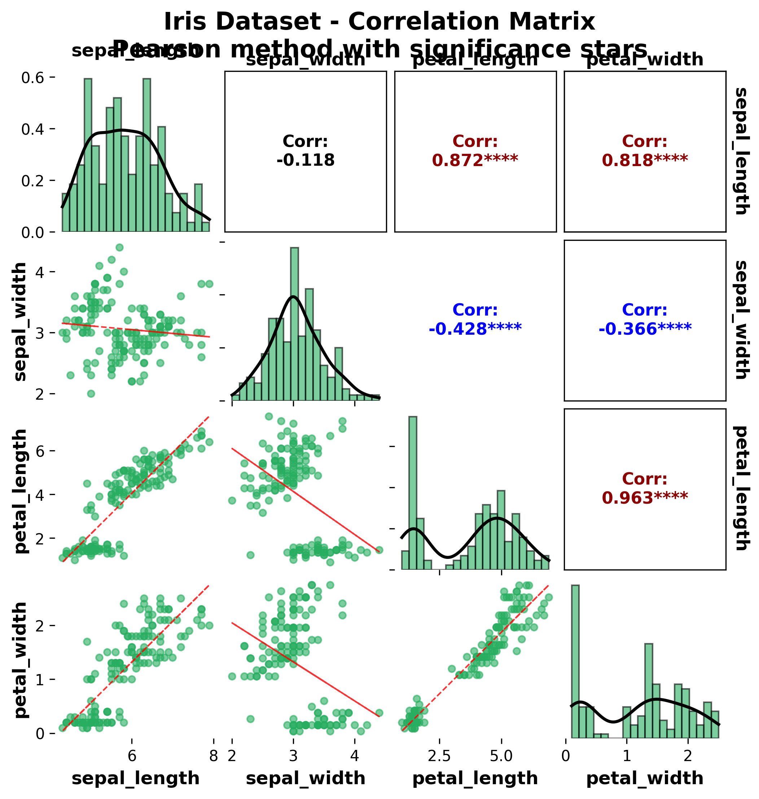

[](https://pypi.org/project/ggpubpy)
[](https://pypi.org/project/ggpubpy)
[](https://github.com/turkalpmd/ggpubpy/blob/main/LICENSE)
[](https://github.com/turkalpmd/ggpubpy)
[](https://github.com/turkalpmd/ggpubpy)

# ggpubpy: 'matplotlib' Based Publication-Ready Plots

Matplotlib is an excellent and flexible package for elegant data visualization in Python. However, the default plotting routines often require extensive boilerplate and manual styling before figures are ready for publication. Customizing complex plots can be a barrier for researchers and analysts without advanced plotting expertise.

The **ggpubpy** library provides a suite of easy-to-use functions for creating and customizing Matplotlib-based, publication-ready plots—complete with built-in statistical tests and automatic p-value or significance star annotations. This project is directly inspired by R's [ggpubr](https://github.com/kassambara/ggpubr) package.

**📦 PyPI Package**: https://pypi.org/project/ggpubpy/  
**🐙 GitHub Repository**: https://github.com/turkalpmd/ggpubpy  


---

## Installation and loading

Install the latest stable release from PyPI (recommended):

```bash
pip install ggpubpy
```

**Why install from PyPI?**
- ✅ Stable, tested releases
- ✅ Automatic dependency management
- ✅ Easy updates with `pip install --upgrade ggpubpy`
- ✅ Compatible with virtual environments

Or install the development version directly from GitHub:

```bash
pip install git+https://github.com/turkalpmd/ggpubpy.git
```

Load the package:

```python
import ggpubpy
from ggpubpy import violinggplot, boxggplot, plot_shift, plot_correlation_matrix
from ggpubpy.datasets import load_iris  # Built-in datasets
```

---

## Core Features

- **Violin + boxplot + jitter** in one call  
- **Correlation matrix plots** with scatter plots, histograms, and statistical annotations
- **Shift plots** for advanced distribution comparison with quantile analysis
- **Automatic color palettes** with ColorBrewer-inspired defaults
- **Built-in datasets** (iris) for quick testing and examples
- **Flexible group comparisons** - works with 2-group, 3-group, or more
- **Built-in Kruskal–Wallis & Mann–Whitney U tests** (or ANOVA & t-tests for parametric option)  
- **Automatic p-value or "star" annotation** with dynamic bracket placement
- **Smart p-value formatting** - pairwise comparisons show significance stars (*, **, ns), global tests show formatted values (<0.001)  
- **Parametric and non-parametric statistical tests** with `parametric=True/False` option
- **Smart test selection** - t-test for 2 groups, ANOVA for 3+ groups (parametric mode)
- **Modular, data-driven API**: custom labels, ordering, figure sizing

---

## Quick Examples

### 🎻 Violin plots with boxplots & jitter + statistical tests

#### 3-Group Comparison (All Species)
```python
import ggpubpy
from ggpubpy.datasets import load_iris

# Load the iris dataset
iris = load_iris()

# Create the plot with default colors (automatic palette)
fig, ax = ggpubpy.violinggplot(
    df=iris, 
    x="species", 
    y="sepal_length",
    x_label="Species", 
    y_label="Sepal Length (cm)"
)
```


#### 2-Group Comparison (Subset Analysis)
```python
# Filter for 2-group comparison
iris_2groups = iris[iris['species'].isin(['setosa', 'versicolor'])]

# Create 2-group comparison plot
fig, ax = ggpubpy.violinggplot(
    df=iris_2groups, 
    x="species", 
    y="sepal_length",
    x_label="Species", 
    y_label="Sepal Length (cm)"
)
```


### 📊 Boxplots with jitter + statistical tests

#### 3-Group Box Plot with Default Colors
```python
# Create boxplot with default automatic colors
fig, ax = ggpubpy.boxggplot(
    df=iris, 
    x="species", 
    y="sepal_length",
    x_label="Species", 
    y_label="Sepal Length (cm)"
)
```


#### 2-Group Box Plot with Statistical Tests
```python
# 2-group comparison with Mann-Whitney U test (non-parametric default)
iris_2groups = iris[iris['species'].isin(['setosa', 'versicolor'])]

fig, ax = ggpubpy.boxggplot(
    df=iris_2groups, 
    x="species", 
    y="sepal_length",
    x_label="Species", 
    y_label="Sepal Length (cm)",
    parametric=False  # Non-parametric tests (default)
)
```


### 📈 Shift plots for distribution comparison

Shift plots provide a powerful visualization for comparing two distributions by showing:
- **Half-violin plots** showing distribution shapes
- **Box plots** with quartiles and outliers  
- **Raw data points** for transparency
- **Quantile connections** (optional) showing how percentiles shift between groups
- **Statistical test results** in the title
- **Quantile difference subplot** (optional) for detailed quantile analysis

#### Basic Shift Plot
```python
# Compare two groups with shift plot
iris_2groups = iris[iris['species'].isin(['setosa', 'versicolor'])]
x = iris_2groups[iris_2groups['species'] == 'setosa']['sepal_length'].values
y = iris_2groups[iris_2groups['species'] == 'versicolor']['sepal_length'].values

fig = ggpubpy.plot_shift(
    x, y, 
    paired=False, 
    n_boot=1000,
    percentiles=[10, 50, 90], 
    confidence=0.95,
    show_quantiles=True,  # Show quantile connection lines
    show_quantile_diff=False,  # Hide quantile difference subplot
    x_name="Setosa", 
    y_name="Versicolor"
)
```


#### Shift Plot with Quantile Differences
```python
# Same plot but with quantile difference subplot
fig = ggpubpy.plot_shift(
    x, y,
    paired=False,
    show_quantiles=True,
    show_quantile_diff=True,  # Show quantile difference subplot
    x_name="Setosa",
    y_name="Versicolor"
)
```


### 🔗 Correlation Matrix Plots

Correlation matrix plots provide a comprehensive view of relationships between multiple variables by combining:
- **Diagonal elements**: Histograms with KDE overlays showing the distribution of each variable
- **Lower triangle**: Scatter plots with trend lines showing pairwise relationships
- **Upper triangle**: Correlation coefficients with significance stars for statistical assessment

This visualization is particularly powerful for:
- **Exploratory data analysis** - quickly identify patterns and relationships
- **Multicollinearity detection** - spot highly correlated variables
- **Variable selection** - understand which variables are most informative
- **Publication-ready figures** - professional appearance with proper statistical annotations

#### Basic Correlation Matrix
```python
# Create correlation matrix for iris dataset
fig, axes = ggpubpy.plot_correlation_matrix(
    iris,
    columns=['sepal_length', 'sepal_width', 'petal_length', 'petal_width'],
    figsize=(8, 8),
    color="#27AE60",
    alpha=0.6,
    point_size=20,
    show_stats=True,
    method="pearson",
    title="Iris Dataset - Correlation Matrix"
)
```



#### Interpreting the Correlation Matrix:
- **Diagonal histograms**: Show the distribution shape of each variable (normal, skewed, bimodal, etc.)
- **Scatter plots (lower triangle)**: Reveal the nature of relationships (linear, non-linear, strength)
- **Correlation values (upper triangle)**: Quantify relationship strength with significance testing
- **Color coding**: Strong correlations (|r| ≥ 0.7) in dark red/blue, moderate (|r| ≥ 0.3) in red/blue
- **Significance stars**: *** (p < 0.001), ** (p < 0.01), * (p < 0.05), no stars (non-significant)

#### Advanced Options
```python
# Different correlation methods and customization
fig, axes = ggpubpy.plot_correlation_matrix(
    df,
    columns=['var1', 'var2', 'var3'],  # Specify variables
    method="spearman",  # or "kendall" for non-parametric
    color="#E74C3C",
    alpha=0.7,
    point_size=25,
    show_stats=False,  # Hide significance stars
    title="Custom Correlation Analysis"
)
```

### 🎨 Advanced Features

```python
# Custom color palette
custom_palette = {
    "setosa": "#FF6B6B", 
    "versicolor": "#4ECDC4", 
    "virginica": "#45B7D1"
}

fig, ax = ggpubpy.violinggplot(
    df=iris, 
    x="species", 
    y="petal_length",
    x_label="Species", 
    y_label="Petal Length (cm)",
    palette=custom_palette
)

# Parametric tests (ANOVA + t-test instead of Kruskal-Wallis + Mann-Whitney)
fig, ax = ggpubpy.violinggplot(
    df=iris, 
    x="species", 
    y="sepal_length",
    x_label="Species", 
    y_label="Sepal Length (cm)",
    parametric=True
)

# Custom ordering
fig, ax = ggpubpy.violinggplot(
    df=iris, 
    x="species",
    y="petal_width",
    order=["virginica", "versicolor", "setosa"]  # Custom order
)
```

### 📊 Built-in Datasets

```python
# Load built-in datasets
iris = ggpubpy.datasets.load_iris()
print(f"Available datasets: {ggpubpy.datasets.list_datasets()}")

# Get recommended color palette for iris species
palette = ggpubpy.datasets.get_iris_palette()
print(palette)  # {'setosa': '#00AFBB', 'versicolor': '#E7B800', 'virginica': '#FC4E07'}
```

---

## 🤝 Contributing

**We welcome contributions!** This project is designed to be contribution-friendly.

### Ways to Contribute:
- 🐛 **Bug reports** and feature requests
- 📖 **Documentation** improvements  
- 🔧 **Code contributions** (new features, optimizations, tests)
- 🎨 **New plot types** and statistical tests
- 📊 **Additional datasets** and examples

### Getting Started:
```bash
# Clone and setup development environment
git clone https://github.com/turkalpmd/ggpubpy.git
cd ggpubpy
pip install -e .
pip install -r requirements-dev.txt

# Run tests to verify setup
python final_check.py
```

### Getting Help & Support
- 🐛 **GitHub Issues**: For bug reports and feature requests.
- 💬 **GitHub Discussions**: For questions, suggestions, and community discussion.
- 📚 **API Reference**: Complete function documentation is available in the source code docstrings.

---

## 📚 Citation

If you use **ggpubpy** in your work, please cite it as:

Akbasli, I. T. (2025). *Python Based Publication-Ready Plots*. Zenodo. https://doi.org/10.5281/zenodo.15707309

Or in BibTeX:

```bibtex
@software{akbasli2025ggpubpy,
  author       = {Izzet Turkalp Akbasli},
  title        = {Python Based Publication-Ready Plots},
  year         = {2025},
  publisher    = {Zenodo},
  doi          = {10.5281/zenodo.15707309},
  url          = {https://doi.org/10.5281/zenodo.15707309}
}
```

---

## License

**ggpubpy** is released under the MIT License. See [LICENSE](https://github.com/turkalpmd/ggpubpy/blob/main/LICENSE) for details.

---

## 📈 Project Status

🎉 **PUBLISHED ON PyPI**: August 16, 2025  
📦 **Latest Version**: 0.3.0  
🌟 **Status**: Stable and ready for production use  
🤝 **Contributing**: Open for community contributions  

**Install now**: `pip install ggpubpy`

---

## 🛠️ Development

For developers and contributors:

### Development Scripts
- **`scripts/`** - Development and maintenance utilities
  - `pre_upload_check.py` - PyPI upload checklist and automation
  - `final_check.py` - Comprehensive testing and quality checks
  - `run_checks.sh` - Quick quality checks (Linux/macOS)

### Project Structure
```
ggpubpy/
├── ggpubpy/           # Main package code
├── tests/             # Test suite
├── examples/          # Usage examples and generated plots
├── scripts/           # Development utilities
├── docs/              # Additional documentation
└── README.md          # This file
```

### Running Tests
```bash
# Run all tests
python -m pytest tests/

# Run with coverage
python -m pytest tests/ --cov=ggpubpy

# Run development checks
python scripts/final_check.py
```

---

## Changelog

### Version 0.3.0 (August 16, 2025)
**🆕 Major Feature Addition: Correlation Matrix Plots**

- ✨ **New function**: `plot_correlation_matrix()` - Create comprehensive correlation matrix visualizations
- 📊 **Diagonal plots**: Histograms with KDE overlay for univariate distributions
- 🔗 **Lower triangle**: Scatter plots with trend lines and confidence intervals
- 📈 **Upper triangle**: Correlation coefficients with statistical significance indicators
- 🎯 **Multiple methods**: Support for Pearson, Spearman, and Kendall correlations
- 🎨 **Customizable**: Full control over colors, sizes, transparency, and statistical display
- 📚 **Documentation**: Comprehensive examples and usage guide added
- 🧪 **Tests**: Complete test coverage for all new functionality

**Improvements:**
- Enhanced error handling and input validation
- Better integration with existing plotting functions
- Updated examples and documentation
- Improved code organization and type hints

### Version 0.2.1 (June 20, 2025)
- Stability improvements and bug fixes
- Enhanced documentation

### Version 0.2.0 (June 20, 2025)
- Initial stable release with core plotting functions
