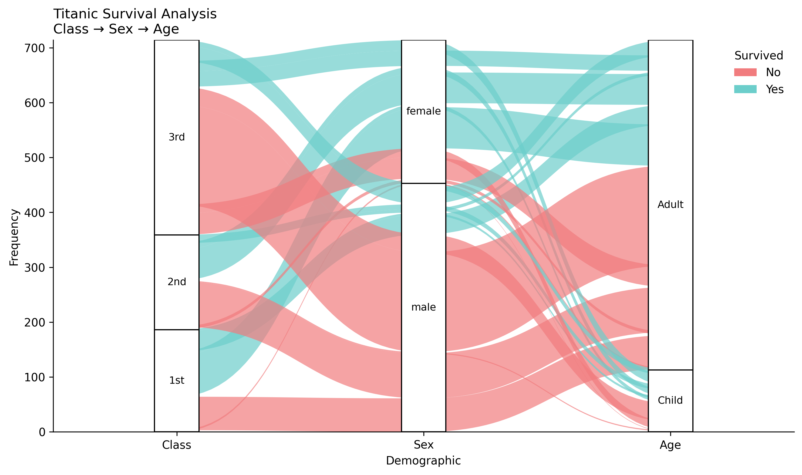
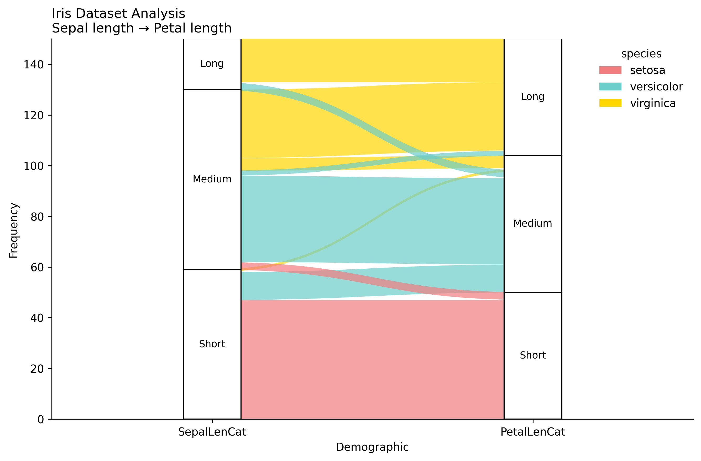

# Alluvial Plots in ggpubpy

Alluvial plots (also known as flow diagrams) are a type of visualization that shows how data flows between different categorical dimensions. They are particularly useful for showing relationships and transitions between categories.

## Features

- **Flow visualization**: Shows how data moves between categorical dimensions
- **Customizable colors**: Color flows by any categorical variable
- **Flexible ordering**: Control the order of categories in each dimension
- **Publication-ready**: Clean, professional appearance suitable for publications
- **Statistical integration**: Ready for future statistical enhancements
- **Bézier curves**: Smooth, aesthetically pleasing flow connections

## Basic Usage

```python
from ggpubpy import plot_alluvial, load_titanic
import pandas as pd
import numpy as np

# Load and prepare data
titanic = load_titanic()
titanic = titanic.dropna(subset=["Age"])
titanic["Class"] = titanic["Pclass"].map({1: "1st", 2: "2nd", 3: "3rd"})
titanic["AgeCat"] = np.where(titanic["Age"] < 18, "Child", "Adult")
titanic["Survived"] = titanic["Survived"].astype(str).replace({"0": "No", "1": "Yes"})

# Create frequency table with alluvium IDs
titanic_tab = (titanic.groupby(["Class", "Sex", "AgeCat", "Survived"])
                    .size()
                    .reset_index(name="Freq")
                    .rename(columns={"AgeCat": "Age"}))
titanic_tab["alluvium"] = titanic_tab.index

# Create alluvial plot
fig, ax = plot_alluvial(
    titanic_tab,
    dims=["Class", "Sex", "Age"],
    value_col="Freq",
    color_by="Survived",
    id_col="alluvium",
    orders={"Class": ["1st", "2nd", "3rd"],
            "Sex": ["male", "female"],
            "Age": ["Child", "Adult"]},
    color_map={"No": "#F17C7E", "Yes": "#6CCECB"},
    title="Titanic Survival Analysis",
    subtitle="Class → Sex → Age",
    alpha=0.7
)
```



## Functions

### `plot_alluvial()`

Creates a basic alluvial plot with flow diagrams between categorical dimensions.

**Parameters:**
- `df`: DataFrame containing the data
- `dims`: List of column names representing the dimensions (axes) of the flow
- `value_col`: Column name containing the frequency/weight values
- `color_by`: Column name to use for coloring the flows
- `id_col`: Column name containing unique identifiers for each flow
- `orders`: Optional dictionary mapping dimension names to ordered category lists
- `color_map`: Optional dictionary mapping category values to colors
- `title`: Main title for the plot
- `subtitle`: Subtitle for the plot
- `figsize`: Figure size in inches (default: (9, 6))
- `alpha`: Transparency level for flow polygons (default: 0.8)
- `x_label`: Label for x-axis (default: "Demographic")
- `y_label`: Label for y-axis (default: "Frequency")

### `plot_alluvial_with_stats()`

Creates an alluvial plot with optional statistical annotations. Currently identical to `plot_alluvial()` but provides a consistent interface for future statistical enhancements.

## Examples

### Iris Dataset Example

```python
from ggpubpy import plot_alluvial, load_iris
import pandas as pd
import matplotlib.pyplot as plt

# Load Iris data
iris = load_iris()

# Create categorical variables from continuous ones
iris["SepalLenCat"] = pd.cut(iris["sepal_length"], bins=3, labels=["Short", "Medium", "Long"])
iris["PetalLenCat"] = pd.cut(iris["petal_length"], bins=3, labels=["Short", "Medium", "Long"])

# Create frequency table with alluvium IDs
iris_tab = (iris.groupby(["SepalLenCat", "PetalLenCat", "species"], observed=True)
            .size()
            .reset_index(name="Freq"))
iris_tab["alluvium"] = iris_tab.index

# Create alluvial plot
fig, ax = plot_alluvial(
    iris_tab,
    dims=["SepalLenCat", "PetalLenCat"],
    value_col="Freq",
    color_by="species",
    id_col="alluvium",
    orders={"SepalLenCat": ["Short", "Medium", "Long"],
            "PetalLenCat": ["Short", "Medium", "Long"]},
    title="Iris Dataset Analysis",
    subtitle="Sepal length → Petal length",
    alpha=0.7
)

plt.show()
```



## Complete Examples

See `examples/alluvial_examples.py` for complete examples including:
- Titanic survival analysis
- Iris dataset analysis
- Custom employee performance data

## Data Requirements

Your data should be in a "long" format with:
1. **Dimensions**: Categorical columns representing the flow axes
2. **Values**: A numeric column representing the frequency/weight of each flow
3. **Colors**: A categorical column for coloring the flows
4. **IDs**: A unique identifier for each flow (alluvium)

## Tips

1. **Data preparation**: Create frequency tables using `groupby().size()` or `groupby().sum()`
2. **Alluvium IDs**: Add a unique identifier column (e.g., `df["alluvium"] = df.index`)
3. **Category ordering**: Use the `orders` parameter to control the sequence of categories
4. **Color schemes**: Provide custom `color_map` for consistent coloring across plots
5. **Transparency**: Adjust `alpha` to control flow visibility and overlapping

## Integration

The alluvial plot functions are fully integrated into the ggpubpy package and can be imported alongside other plotting functions:

```python
from ggpubpy import plot_alluvial, plot_boxplot, plot_violin
```
