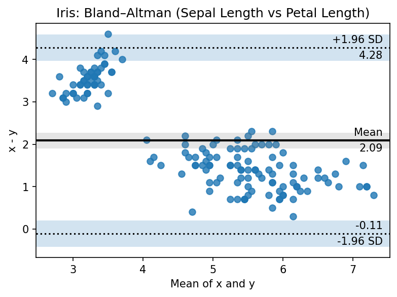

# Bland–Altman Plot

Bland–Altman plots visualize agreement between two measurement methods by showing mean bias and limits of agreement.

## Features

- Mean difference (bias) line and ±k·SD limits of agreement (default k=1.96)
- Optional confidence intervals for bias and agreement limits
- Optional textual annotations of key values
- Publication-ready styling and custom scatter kwargs

## Basic Usage (Iris)

```python
from ggpubpy import plot_blandaltman, load_iris
import matplotlib.pyplot as plt

iris = load_iris()
fig, ax = plt.subplots(figsize=(6, 4))
plot_blandaltman(
    iris["sepal_length"].values,
    iris["petal_length"].values,
    agreement=1.96,
    confidence=0.95,
    annotate=True,
    ax=ax,
)
ax.set_title("Iris: Bland–Altman (Sepal Length vs Petal Length)")
plt.tight_layout()
```



## Second Example (Iris)

```python
from ggpubpy import plot_blandaltman, load_iris
import matplotlib.pyplot as plt

iris = load_iris()
fig, ax = plt.subplots(figsize=(6, 4))
plot_blandaltman(
    iris["sepal_width"].values,
    iris["petal_width"].values,
    agreement=1.96,
    confidence=0.95,
    annotate=False,
    ax=ax,
)
ax.set_title("Iris: Bland–Altman (Sepal Width vs Petal Width)")
plt.tight_layout()
```


## Function Parameters

### `plot_blandaltman()`

- `x, y` (array-like): Two sets of measurements (equal length)
- `agreement` (float): Multiplier for limits of agreement (default: 1.96)
- `xaxis` (str): Reference for x-axis: "mean", "x", or "y" (default: "mean")
- `confidence` (float or None): CI for bias and LoA; None disables shaded CIs
- `annotate` (bool): Add text annotations (default: True)
- `ax` (matplotlib.axes.Axes, optional): Target axes
- `**kwargs`: Passed to `Axes.scatter` (e.g., color, alpha)

## Tips

1. Use `xaxis="mean"` for the standard Bland–Altman representation.
2. Consider setting `annotate=False` for dense datasets.
3. Adjust `agreement` to explore different LoA (e.g., 2.0 for exact ±2 SD).
4. Ensure comparable units and consistent preprocessing for meaningful comparisons.

Note: The figures on this page are generated by running `examples/bland_altman_example.py` and `examples/plots_manipulation_examples.py`.
