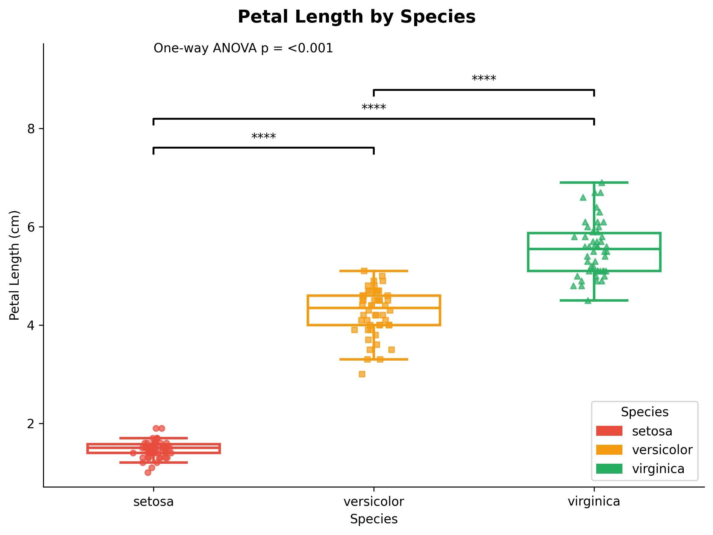
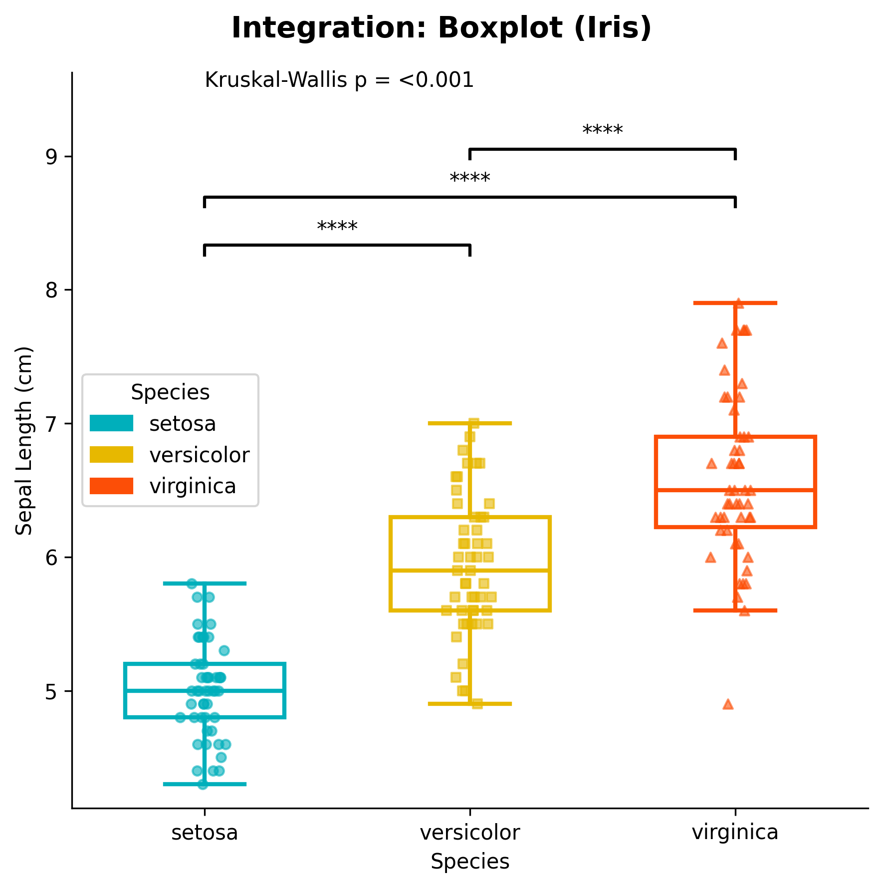
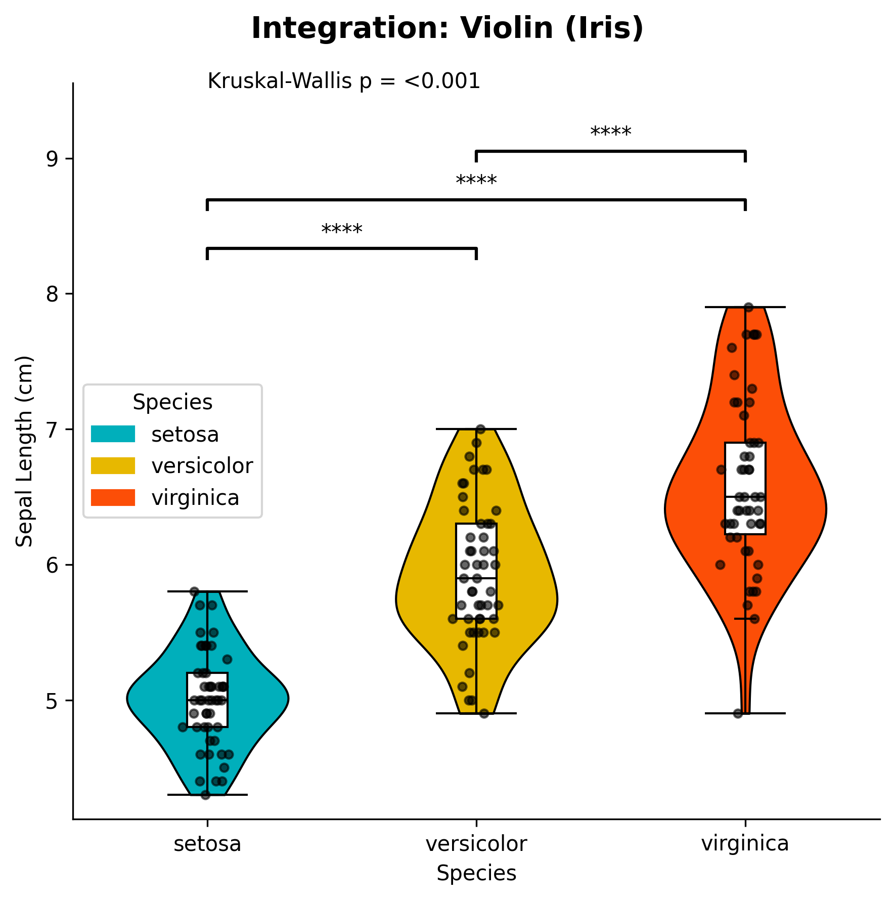

# Boxplot with Statistical Annotations

Boxplots are a great way to visualize the distribution of data across different groups. The `plot_boxplot_with_stats` function creates publication-ready boxplots with built-in statistical tests and automatic p-value annotations.

## Features

- **Statistical tests**: Automatic ANOVA/Kruskal-Wallis and pairwise comparisons
- **Jittered points**: Optional individual data points with different markers
- **Custom colors**: Flexible color palette support
- **Publication-ready**: Clean, professional appearance
- **Flexible ordering**: Control the order of groups

## Basic Usage

```python
from ggpubpy import plot_boxplot_with_stats, load_iris
import matplotlib.pyplot as plt

# Load sample data
iris = load_iris()

# Create boxplot with statistical annotations (matches examples/boxplot_example.png)
fig, ax = plot_boxplot_with_stats(
    df=iris,
    x="species",
    y="sepal_length",
    x_label="Species",
    y_label="Sepal Length (cm)",
    title="Iris: Sepal Length by Species",
    subtitle="Box plot with ANOVA + pairwise",
    parametric=True,
    alpha=0.6,
)

plt.show()
```


## Function Parameters

### `plot_boxplot_with_stats()`

**Parameters:**

- `df` (pd.DataFrame): Your data
- `x` (str): Column name for categories (must be categorical)
- `y` (str): Column name for numeric values
- `x_label` (str, optional): Axis label for x-axis. Defaults to column name
- `y_label` (str, optional): Axis label for y-axis. Defaults to column name
- `title` (str, optional): Overall plot title
- `subtitle` (str, optional): Plot subtitle
- `order` (list, optional): Order of x categories. Defaults to sorted unique values
- `palette` (dict, optional): Mapping from category to color
- `figsize` (tuple): Figure size (default: (6, 6))
- `add_jitter` (bool): Whether to add jittered points (default: True)
- `jitter_std` (float): Standard deviation for horizontal jitter (default: 0.04)
- `alpha` (float, optional): Transparency for jittered points (default: 0.7)
- `box_width` (float): Width of each box in the plot (default: 0.6)
- `global_test` (bool): Whether to perform and display global statistical test (default: True)
- `pairwise_test` (bool): Whether to perform and display pairwise comparisons (default: True)
- `parametric` (bool): If True, use parametric tests (ANOVA + t-test). If False, use non-parametric tests (Kruskal-Wallis + Mann-Whitney U) (default: False)

**Returns:**
- `tuple`: (figure, axes) matplotlib objects

## Examples

### Two Groups Example

```python
from ggpubpy import plot_boxplot_with_stats, load_iris
import matplotlib.pyplot as plt

# Load Iris data (two groups: setosa vs versicolor)
iris = load_iris()
iris_2 = iris[iris["species"].isin(["setosa", "versicolor"])]

# Create boxplot comparing two groups (matches examples/boxplot_2groups_example.png)
fig, ax = plot_boxplot_with_stats(
    df=iris_2,
    x="species",
    y="sepal_length",
    x_label="Species",
    y_label="Sepal Length (cm)",
    title="Iris: Setosa vs Versicolor",
    subtitle="Box plot with Mann-Whitney U",
    parametric=False,
    alpha=0.6,
)

plt.show()
```


### Three Groups Example

```python
from ggpubpy import plot_boxplot_with_stats, load_iris
import matplotlib.pyplot as plt

# Load Iris data
iris = load_iris()

# Create boxplot with three groups
fig, ax = plot_boxplot_with_stats(
    df=iris,
    x="species",
    y="petal_length",
    x_label="Species",
    y_label="Petal Length (cm)",
    title="Petal Length by Species",
    order=["setosa", "versicolor", "virginica"],
    palette={"setosa": "#FF6B6B", "versicolor": "#4ECDC4", "virginica": "#45B7D1"},
    figsize=(8, 6),
    parametric=True  # Use parametric tests
)

plt.show()
```



### Custom Styling Example

```python
from ggpubpy import plot_boxplot_with_stats, load_iris
import matplotlib.pyplot as plt

# Load Iris data
iris = load_iris()

# Create custom styled boxplot
fig, ax = plot_boxplot_with_stats(
    df=iris,
    x="species",
    y="sepal_width",
    x_label="Species",
    y_label="Sepal Width (cm)",
    title="Sepal Width Distribution",
    subtitle="Statistical comparison across species",
    order=["setosa", "versicolor", "virginica"],
    palette={"setosa": "#E74C3C", "versicolor": "#F39C12", "virginica": "#27AE60"},
    figsize=(10, 7),
    add_jitter=True,
    jitter_std=0.05,
    box_width=0.7,
    global_test=True,
    pairwise_test=True,
    parametric=False
)

plt.show()
```

## Statistical Tests

The function automatically performs appropriate statistical tests:

### Global Test
- **Parametric**: One-way ANOVA
- **Non-parametric**: Kruskal-Wallis test

### Pairwise Comparisons
- **Parametric**: Independent t-tests with multiple comparison correction
- **Non-parametric**: Mann-Whitney U tests with multiple comparison correction

### Significance Levels
- `***` p < 0.001
- `**` p < 0.01
- `*` p < 0.05
- `ns` p ≥ 0.05

## Tips

1. **Choose appropriate tests**: Use parametric tests for normally distributed data, non-parametric for skewed data
2. **Custom colors**: Provide a palette dictionary for consistent coloring
3. **Jitter points**: Help visualize individual data points and sample sizes
4. **Order groups**: Use the `order` parameter to control the sequence of groups
5. **Figure size**: Adjust `figsize` based on the number of groups and your publication requirements

## Integration

The boxplot function integrates seamlessly with other ggpubpy functions:

```python
from ggpubpy import plot_boxplot_with_stats, plot_violin_with_stats, load_iris

# Create multiple plots for comparison
iris = load_iris()

# Boxplot
fig1, ax1 = plot_boxplot_with_stats(iris, "species", "sepal_length")

# Violin plot
fig2, ax2 = plot_violin_with_stats(iris, "species", "sepal_length")
```
Note: The figures on this page are generated by running `examples/boxplot_examples.py` and `examples/boxplot_extra_examples.py` using identical parameters.



