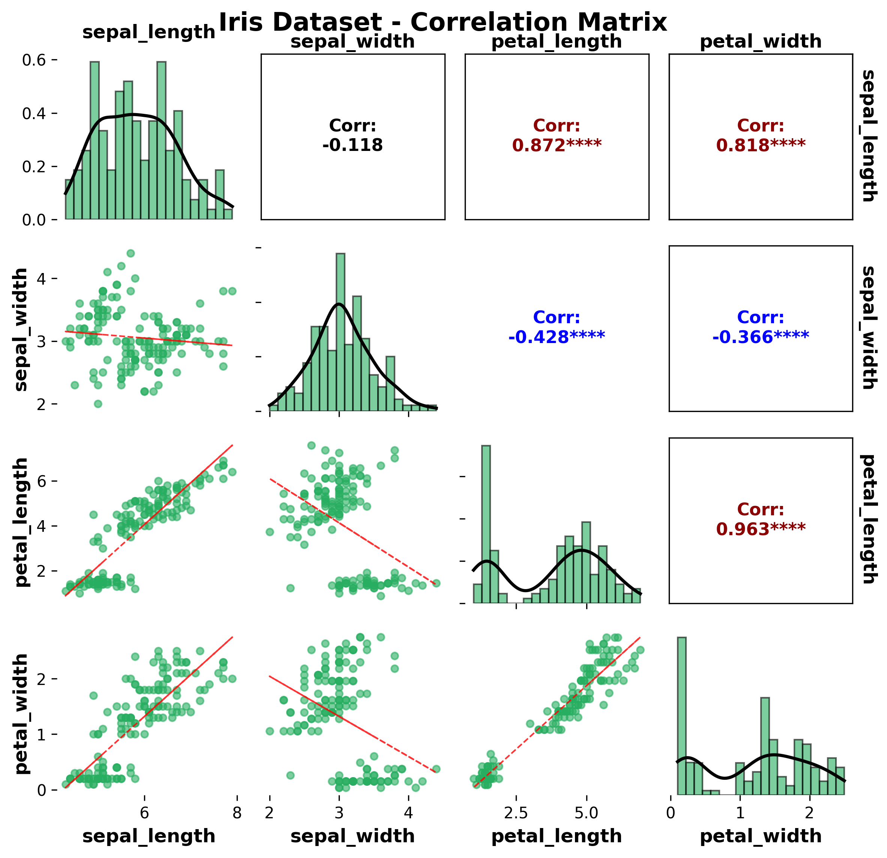
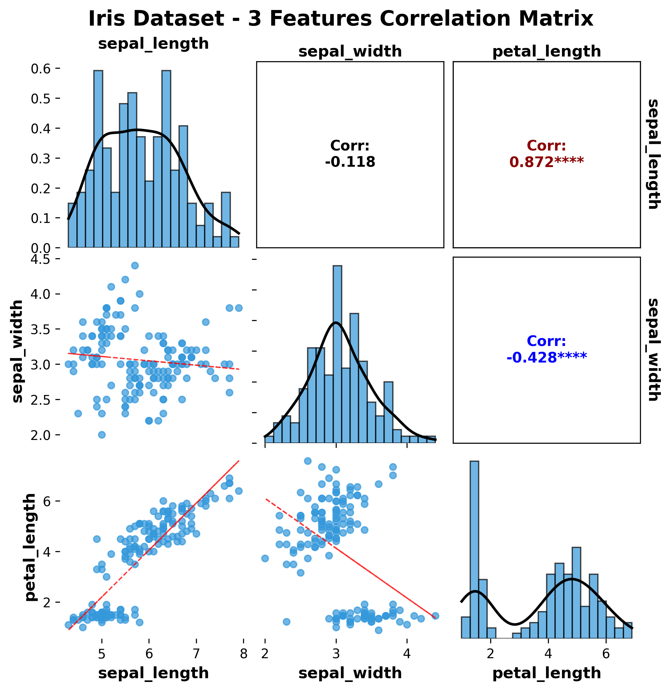
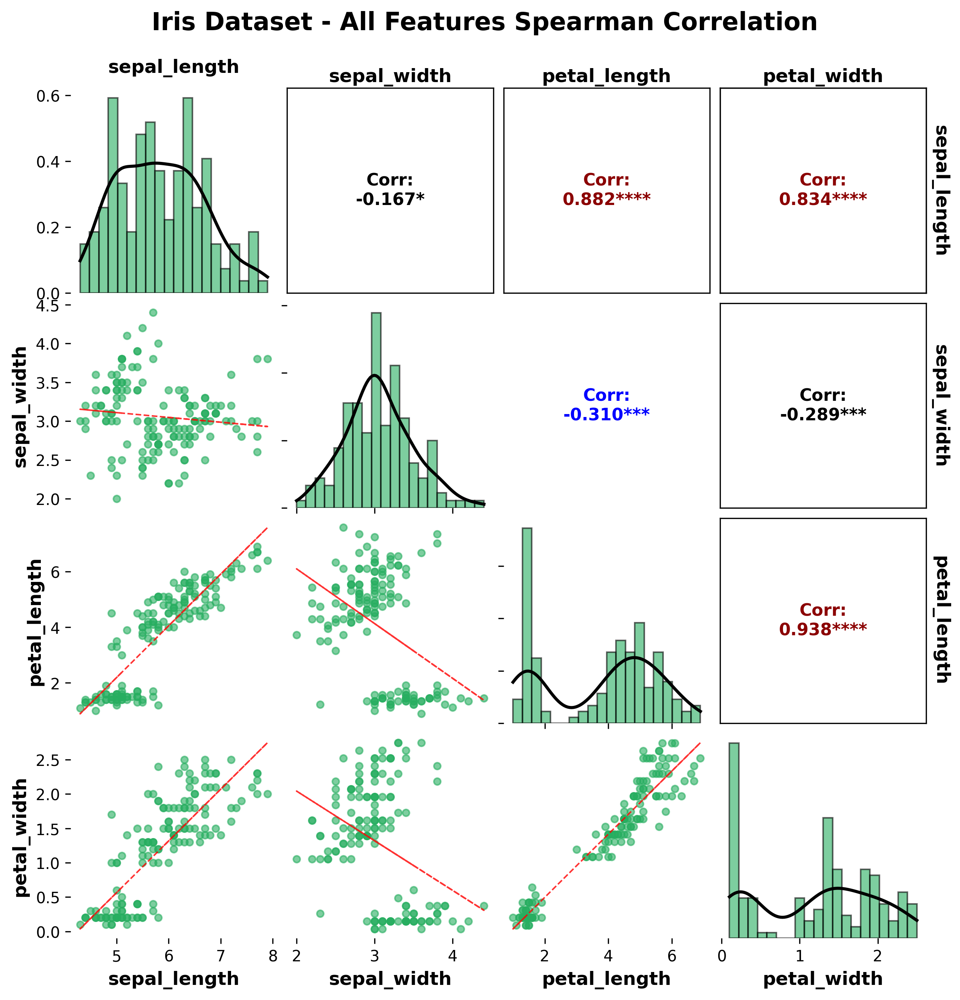
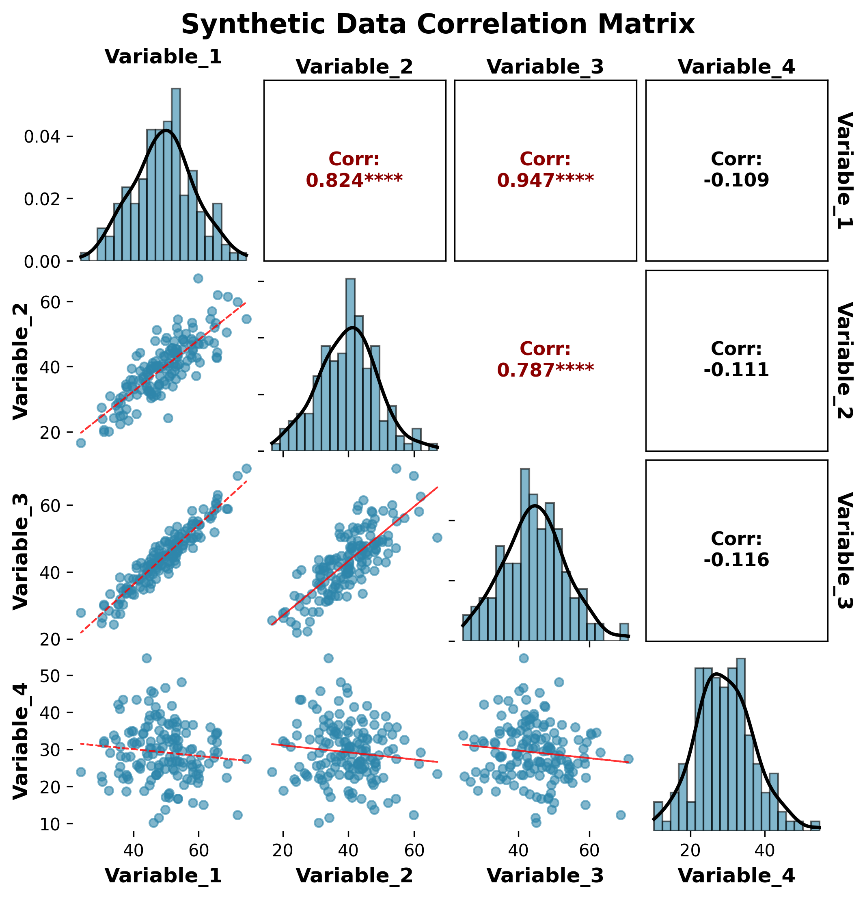

# Correlation Matrix Plot

Correlation matrix plots provide a comprehensive visualization of relationships between multiple variables. The `plot_correlation_matrix` function creates publication-ready correlation matrices with scatter plots, correlation values, and statistical significance indicators.

## Features

- **Scatter plot matrix**: Shows pairwise relationships between variables
- **Correlation values**: Displays correlation coefficients with significance levels
- **Statistical significance**: Indicates significant correlations with symbols
- **Custom colors**: Flexible color palette support
- **Publication-ready**: Clean, professional appearance
- **Multiple datasets**: Support for different datasets and synthetic data

## Basic Usage

```python
from ggpubpy import plot_correlation_matrix, load_iris
import matplotlib.pyplot as plt

# Load sample data
iris = load_iris()

# Create correlation matrix plot
fig, axes = plot_correlation_matrix(
    df=iris,
    columns=['sepal_length', 'sepal_width', 'petal_length', 'petal_width'],
    title="Iris Dataset Correlation Matrix"
)

plt.show()
```



## Function Parameters

### `plot_correlation_matrix()`

**Parameters:**

- `df` (pd.DataFrame): Input data
- `columns` (list, optional): List of column names to include. If None, uses all numeric columns
- `figsize` (tuple): Figure size (default: (10, 10))
- `color` (str): Color for scatter points (default: '#2E86AB')
- `alpha` (float): Transparency for scatter points (default: 0.6)
- `point_size` (float): Scatter point size (default: 20)
- `show_stats` (bool): Whether to show significance stars (default: True)
- `method` (str): Correlation method ('pearson', 'spearman', 'kendall') (default: 'pearson')
- `title` (str, optional): Plot title
- `subtitle` (str, optional): Plot subtitle

**Returns:**
- `tuple`: (figure, axes_array) matplotlib objects

## Examples

### Iris Dataset - 3 Features

```python
from ggpubpy import plot_correlation_matrix, load_iris
import matplotlib.pyplot as plt

# Load Iris data
iris = load_iris()

# Create correlation matrix with 3 features
fig, axes = plot_correlation_matrix(
    df=iris,
    columns=['sepal_length', 'sepal_width', 'petal_length'],
    title="Iris Dataset - 3 Features Correlation Matrix",
    figsize=(8, 6)
)

plt.show()
```



### Iris Dataset - 4 Features

```python
from ggpubpy import plot_correlation_matrix, load_iris
import matplotlib.pyplot as plt

# Load Iris data
iris = load_iris()

# Create correlation matrix with all 4 features
fig, axes = plot_correlation_matrix(
    df=iris,
    columns=['sepal_length', 'sepal_width', 'petal_length', 'petal_width'],
    title="Iris Dataset - Complete Correlation Matrix",
    figsize=(10, 8),
    alpha=0.7,
    method='pearson'
)

plt.show()
```



### Synthetic Data Example

```python
from ggpubpy import plot_correlation_matrix
import matplotlib.pyplot as plt
import pandas as pd
import numpy as np

# Create synthetic data with known correlations
np.random.seed(42)
n = 100

# Generate correlated variables
x1 = np.random.normal(0, 1, n)
x2 = 0.7 * x1 + np.random.normal(0, 0.7, n)  # Strong positive correlation
x3 = -0.5 * x1 + np.random.normal(0, 0.8, n)  # Moderate negative correlation
x4 = np.random.normal(0, 1, n)  # Independent variable

# Create DataFrame
synthetic_data = pd.DataFrame({
    'Variable_A': x1,
    'Variable_B': x2,
    'Variable_C': x3,
    'Variable_D': x4
})

# Create correlation matrix plot
fig, axes = plot_correlation_matrix(
    df=synthetic_data,
    title="Synthetic Data Correlation Matrix",
    subtitle="Demonstrating different correlation strengths",
    figsize=(10, 8),
    alpha=0.6,
    method='pearson'
)

plt.show()
```



### Custom Styling Example

```python
from ggpubpy import plot_correlation_matrix, load_iris
import matplotlib.pyplot as plt

# Load Iris data
iris = load_iris()

# Create custom styled correlation matrix
fig, axes = plot_correlation_matrix(
    df=iris,
    columns=['sepal_length', 'sepal_width', 'petal_length', 'petal_width'],
    title="Custom Styled Correlation Matrix",
    figsize=(12, 10),
    alpha=0.5,
    method='spearman',
    show_stats=True
)

# Add custom annotations on the top-left subplot
ax = axes[0, 0]
ax.text(0.5, 1.02, 'Spearman correlation coefficients',
        transform=ax.transAxes, ha='center', fontsize=12,
        bbox=dict(boxstyle="round,pad=0.3", facecolor="lightblue", alpha=0.7))

plt.show()
```

## Correlation Methods

### Pearson Correlation
- **Use case**: Linear relationships, normally distributed data
- **Range**: -1 to +1
- **Interpretation**: Linear correlation strength

### Spearman Correlation
- **Use case**: Monotonic relationships, non-parametric
- **Range**: -1 to +1
- **Interpretation**: Rank-based correlation strength

### Kendall Correlation
- **Use case**: Ordinal data, small sample sizes
- **Range**: -1 to +1
- **Interpretation**: Concordance between rankings

## Significance Levels

The plot shows significance symbols:
- `***` p < 0.001
- `**` p < 0.01
- `*` p < 0.05
- No symbol: p ≥ significance_level

## Interpretation Guide

### Correlation Strength
- **|r| > 0.8**: Very strong correlation
- **0.6 < |r| ≤ 0.8**: Strong correlation
- **0.4 < |r| ≤ 0.6**: Moderate correlation
- **0.2 < |r| ≤ 0.4**: Weak correlation
- **|r| ≤ 0.2**: Very weak or no correlation

### Visual Elements
1. **Scatter plots**: Show the actual data points and relationship shape
2. **Correlation values**: Numerical correlation coefficients
3. **Color intensity**: Reflects correlation strength
4. **Significance symbols**: Indicate statistical significance

## When to Use Correlation Matrices

Correlation matrices are useful for:

1. **Exploratory data analysis**: Understanding variable relationships
2. **Feature selection**: Identifying highly correlated variables
3. **Multicollinearity detection**: Finding problematic correlations
4. **Data quality assessment**: Checking for unexpected relationships
5. **Publication figures**: Professional visualization of correlations

## Tips

1. **Choose appropriate method**: Use Pearson for linear relationships, Spearman for monotonic
2. **Handle missing data**: Ensure data is complete or handle missing values appropriately
3. **Sample size**: Larger samples provide more reliable correlation estimates
4. **Outliers**: Be aware of outliers that might inflate or deflate correlations
5. **Multiple comparisons**: Consider adjusting significance levels for multiple tests
6. **Color schemes**: Choose color maps that are accessible and publication-friendly

## Integration

The correlation matrix function integrates seamlessly with other ggpubpy functions:

```python
from ggpubpy import plot_correlation_matrix, plot_boxplot_with_stats, load_iris

# Load data
iris = load_iris()

# Correlation matrix for overall relationships
fig1, axes1 = plot_correlation_matrix(iris, title="Variable Relationships")

# Box plots for individual variable distributions
fig2, ax2 = plot_boxplot_with_stats(iris, "species", "sepal_length")
```

## Advanced Usage

### Custom Correlation Analysis

```python
from ggpubpy import plot_correlation_matrix
import pandas as pd
import numpy as np
from scipy.stats import pearsonr

# Create custom data
np.random.seed(42)
data = pd.DataFrame({
    'X1': np.random.normal(0, 1, 50),
    'X2': np.random.normal(0, 1, 50),
    'X3': np.random.normal(0, 1, 50)
})

# Add some correlation
data['X2'] = 0.6 * data['X1'] + 0.8 * data['X2']
data['X3'] = -0.4 * data['X1'] + 0.9 * data['X3']

# Create plot
fig, axes = plot_correlation_matrix(
    df=data,
    title="Custom Correlation Analysis",
    method='pearson'
)

# Add custom statistical information
corr_matrix = data.corr()
n = len(data)

# Add note on the first subplot
ax = axes[0, 0]
ax.text(0.02, 0.98, f'Sample size: n = {n}\nMethod: Pearson correlation', 
        transform=ax.transAxes, fontsize=10, verticalalignment='top',
        bbox=dict(boxstyle="round,pad=0.3", facecolor="lightgreen", alpha=0.7))

plt.show()
```
