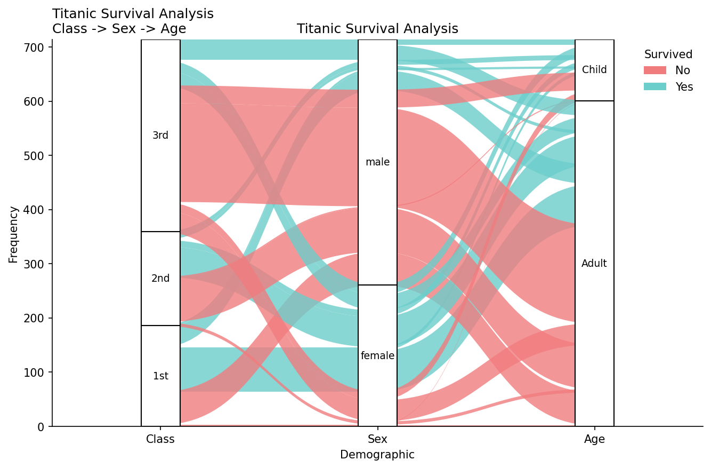

# Plots Manipulation Guide (Labels, Titles, Colors)

This page demonstrates how to customize labels, titles, subtitles, and colors for each plot type. All images on this page are generated by running `examples/plots_manipulation_examples.py`.

## Boxplot

```python
from ggpubpy import plot_boxplot_with_stats, load_iris
import matplotlib.pyplot as plt

iris = load_iris()
fig, ax = plot_boxplot_with_stats(
    df=iris,
    x="species",
    y="sepal_length",
    x_label="Species",
    y_label="Sepal Length (cm)",
    title="Iris: Sepal Length by Species",
    subtitle="ANOVA + pairwise comparisons",
    palette={"setosa": "#1f77b4", "versicolor": "#ff7f0e", "virginica": "#2ca02c"},
)
# Post adjustments (optional)
ax.set_xlabel("Species")
ax.set_ylabel("Sepal Length (cm)")
ax.set_title("Iris: Sepal Length by Species")
fig.savefig("examples/plots_manip_boxplot.png", dpi=150, bbox_inches="tight")
```


## Violin Plot

```python
from ggpubpy import plot_violin_with_stats, load_iris
import matplotlib.pyplot as plt

iris = load_iris()
fig, ax = plot_violin_with_stats(
    df=iris,
    x="species",
    y="petal_width",
    x_label="Species",
    y_label="Petal Width (cm)",
    title="Iris: Petal Width by Species",
    subtitle="Non-parametric tests",
    palette={"setosa": "#8c564b", "versicolor": "#e377c2", "virginica": "#17becf"},
)
ax.set_xlabel("Species")
ax.set_ylabel("Petal Width (cm)")
ax.set_title("Iris: Petal Width by Species")
fig.savefig("examples/plots_manip_violin.png", dpi=150, bbox_inches="tight")
```


## Shift Plot (two-panel control)

```python
from ggpubpy import plot_shift, load_iris
import matplotlib.pyplot as plt

iris = load_iris()
x = iris[iris["species"] == "setosa"]["sepal_length"].values
y = iris[iris["species"] == "versicolor"]["sepal_length"].values

fig = plot_shift(
    x,
    y,
    paired=False,
    show_quantiles=True,
    show_quantile_diff=True,
    x_label="Setosa",
    y_label="Versicolor",
    title="Iris: Setosa vs Versicolor Shift Plot",
    subtitle="Main + quantile differences",
    color="#27AE60",
    line_color="#2C3E50",
)

ax_main, ax_shift = fig.axes
ax_main.set_xlabel("Setosa")
ax_main.set_ylabel("Versicolor")
ax_main.set_title("Iris: Setosa vs Versicolor Shift Plot")
ax_shift.set_xlabel("Setosa quantiles")
ax_shift.set_ylabel("Versicolor - Setosa quantile differences")
fig.savefig("examples/plots_manip_shift.png", dpi=150, bbox_inches="tight")
```


## Correlation Matrix

```python
from ggpubpy import plot_correlation_matrix, load_iris
import matplotlib.pyplot as plt

iris = load_iris()
fig, axes = plot_correlation_matrix(
    df=iris,
    columns=["sepal_length", "sepal_width", "petal_length", "petal_width"],
    title="Iris Dataset - Correlation Matrix",
    subtitle="Pearson correlation with significance",
    color="#2E86AB",
    alpha=0.6,
)
axes[0, 0].set_xlabel("Sepal Length (cm)")
axes[0, 0].set_ylabel("Sepal Length (cm)")
fig.savefig("examples/plots_manip_corr.png", dpi=150, bbox_inches="tight")
```


## Alluvial Plot

```python
from ggpubpy import plot_alluvial, load_titanic
import pandas as pd
import numpy as np
import matplotlib.pyplot as plt

# Prepare Titanic
titanic = load_titanic()
titanic = titanic.dropna(subset=["Age"])
titanic["Class"] = titanic["Pclass"].map({1: "1st", 2: "2nd", 3: "3rd"})
titanic["AgeCat"] = np.where(titanic["Age"] < 18, "Child", "Adult")
titanic["Survived"] = titanic["Survived"].astype(str).replace({"0": "No", "1": "Yes"})

# Frequency table with IDs
tab = (
    titanic.groupby(["Class", "Sex", "AgeCat", "Survived"]).size().reset_index(name="Freq")
)
tab = tab.rename(columns={"AgeCat": "Age"})
tab["alluvium"] = tab.index

fig, ax = plot_alluvial(
    tab,
    dims=["Class", "Sex", "Age"],
    value_col="Freq",
    color_by="Survived",
    id_col="alluvium",
    x_label="Demographic",
    y_label="Frequency",
    title="Titanic Survival Analysis",
    subtitle="Class -> Sex -> Age",
    color_map={"No": "#F17C7E", "Yes": "#6CCECB"},
)
ax.set_xlabel("Demographic")
ax.set_ylabel("Frequency")
ax.set_title("Titanic Survival Analysis")
fig.savefig("examples/plots_manip_alluvial.png", dpi=150, bbox_inches="tight")
```


