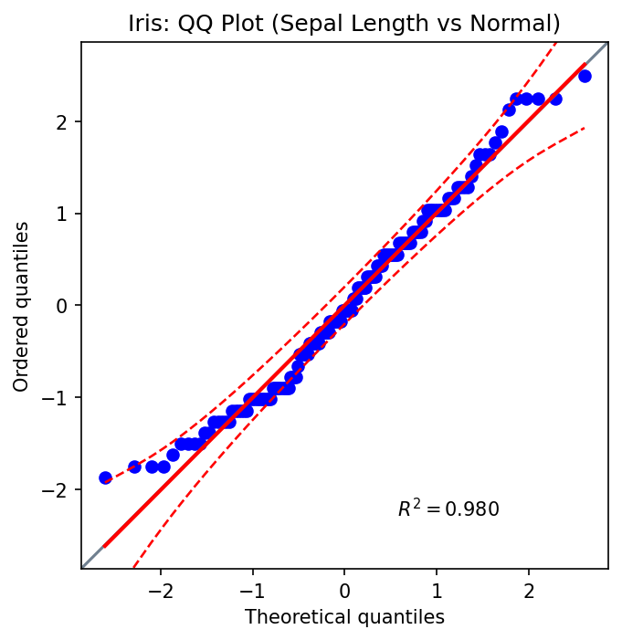
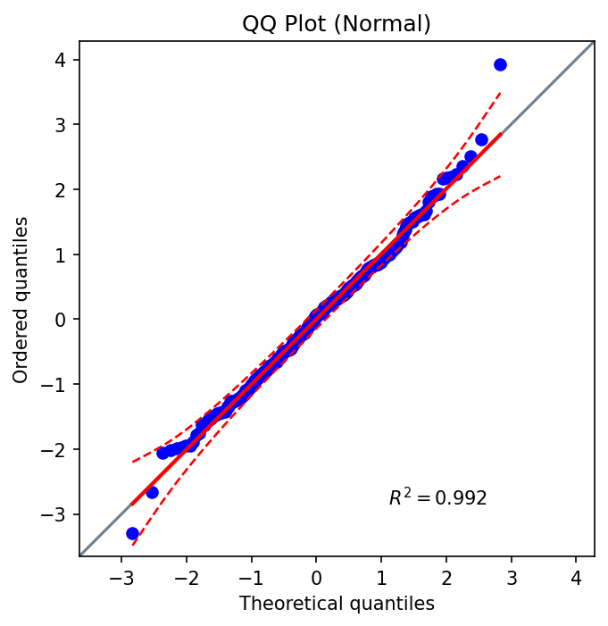

# QQ Plot

Quantile–Quantile (Q–Q) plots compare sample quantiles to theoretical quantiles of a reference distribution to assess distributional agreement.

## Features

- Visual check against a chosen reference distribution (default: Normal)
- Optional confidence envelope for point-wise uncertainty
- Best-fit regression line with R² annotation
- Publication-ready styling and custom scatter kwargs

## Basic Usage (Iris)

```python
from ggpubpy import qqplot, load_iris
import matplotlib.pyplot as plt

iris = load_iris()
fig, ax = plt.subplots(figsize=(5, 5))
qqplot(iris["sepal_length"].values, dist="norm", confidence=0.95, ax=ax)
ax.set_title("Iris: QQ Plot (Sepal Length vs Normal)")
plt.tight_layout()
```



## Second Example (Iris)

```python
from ggpubpy import qqplot, load_iris
import matplotlib.pyplot as plt

iris = load_iris()
fig, ax = plt.subplots(figsize=(5, 5))
qqplot(iris["petal_width"].values, dist="norm", confidence=0.95, ax=ax)
ax.set_title("Iris: QQ Plot (Petal Width vs Normal)")
plt.tight_layout()
```



## Function Parameters

### `qqplot()`

- `x` (array-like): Sample data
- `dist` (str or scipy.stats distribution): Reference distribution (default: "norm")
- `sparams` (tuple, optional): Distribution shape/location/scale parameters
- `confidence` (float or bool): Envelope level in (0,1) or False to disable (default: 0.95)
- `square` (bool): Keep equal aspect ratio (default: True)
- `ax` (matplotlib.axes.Axes, optional): Target axes
- `**kwargs`: Passed to `Axes.scatter` (e.g., color, marker, alpha)

## Tips

1. Use the envelope to gauge departure from the reference distribution.
2. Provide `sparams` for non-standard distribution parameters.
3. Keep axes square for visual parity of deviations.
4. Style points via `**kwargs` for clarity (e.g., `alpha=0.7`).

## Integration

```python
from ggpubpy import qqplot, plot_boxplot_with_stats, load_iris
import matplotlib.pyplot as plt

iris = load_iris()
fig1, ax1 = plt.subplots(figsize=(5, 5))
qqplot(iris["sepal_length"].values, ax=ax1)

fig2, ax2 = plot_boxplot_with_stats(iris, x="species", y="sepal_length")
```

Note: The figures on this page are generated by running `examples/qqplot_example.py` and `examples/plots_manipulation_examples.py`.
