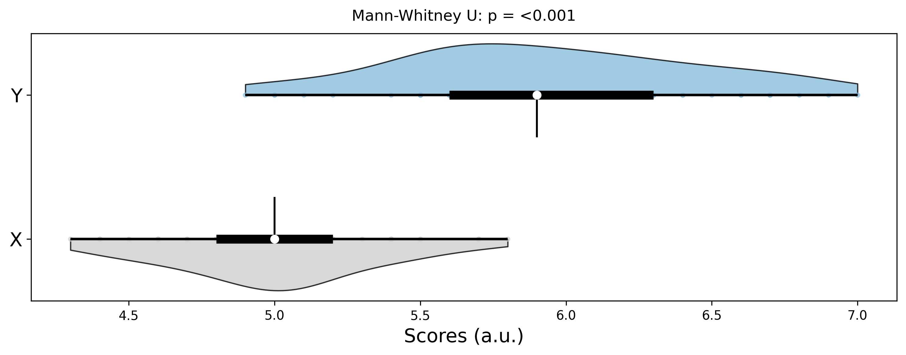
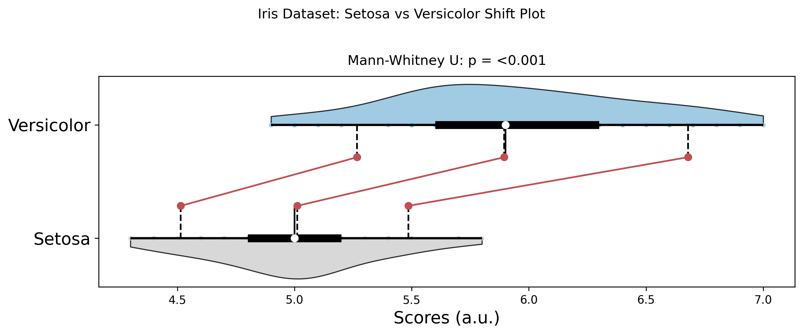
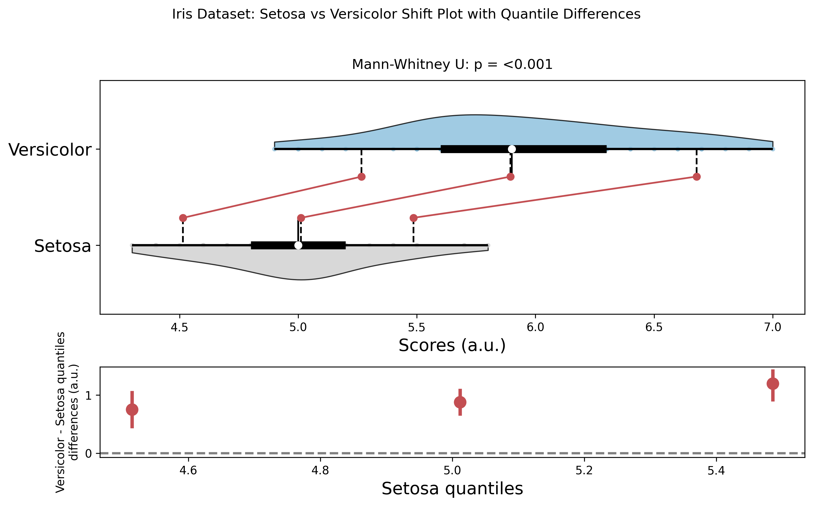

# Shift Plot

Shift plots (also known as difference plots or before-after plots) are used to visualize the differences between two related measurements. They are particularly useful for paired data analysis, before-after comparisons, and treatment effect visualization.

## Features

- **Paired data visualization**: Shows relationships between two related measurements
- **Difference highlighting**: Clearly displays the magnitude and direction of changes
- **Statistical annotations**: Optional statistical tests for paired comparisons
- **Custom styling**: Flexible color and marker options
- **Publication-ready**: Clean, professional appearance

## Basic Usage

```python
from ggpubpy import plot_shift, load_iris
import matplotlib.pyplot as plt
import numpy as np

# Create sample paired data
np.random.seed(42)
before = np.random.normal(5, 1, 50)
after = before + np.random.normal(0.5, 0.8, 50)

# Create shift plot
fig, ax = plot_shift(
    x=before,
    y=after,
    x_label="Before Treatment",
    y_label="After Treatment",
    title="Treatment Effect Analysis"
)

plt.show()
```



## Function Parameters

### `plot_shift()`

**Parameters:**

- `x` (array-like): First measurement (e.g., before treatment)
- `y` (array-like): Second measurement (e.g., after treatment)
- `x_label` (str, optional): Label for x-axis
- `y_label` (str, optional): Label for y-axis
- `title` (str, optional): Plot title
- `figsize` (tuple): Figure size (default: (8, 6))
- `alpha` (float): Transparency for points (default: 0.7)
- `color` (str): Color for points and lines (default: '#2E86AB')
- `line_color` (str): Color for connecting lines (default: '#A23B72')
- `add_stats` (bool): Whether to add statistical annotations (default: True)
- `show_diagonal` (bool): Whether to show diagonal reference line (default: True)

**Returns:**
- `tuple`: (figure, axes) matplotlib objects

## Examples

### Basic Shift Plot

```python
from ggpubpy import plot_shift
import matplotlib.pyplot as plt
import numpy as np

# Create sample data
np.random.seed(42)
n = 30
before = np.random.normal(10, 2, n)
after = before + np.random.normal(1, 1.5, n)

# Create basic shift plot
fig, ax = plot_shift(
    x=before,
    y=after,
    x_label="Baseline Score",
    y_label="Follow-up Score",
    title="Score Improvement Analysis",
    figsize=(8, 6)
)

plt.show()
```



### Shift Plot with Difference Visualization

```python
from ggpubpy import plot_shift
import matplotlib.pyplot as plt
import numpy as np

# Create sample data with clear treatment effect
np.random.seed(42)
n = 25
before = np.random.normal(8, 1.5, n)
after = before + np.random.normal(2, 1, n)  # Clear improvement

# Create shift plot with difference visualization
fig, ax = plot_shift(
    x=before,
    y=after,
    x_label="Pre-treatment",
    y_label="Post-treatment",
    title="Treatment Effectiveness",
    subtitle="Individual patient outcomes",
    color='#E74C3C',
    line_color='#8E44AD',
    alpha=0.8,
    figsize=(10, 7)
)

plt.show()
```



### Custom Styling Example

```python
from ggpubpy import plot_shift
import matplotlib.pyplot as plt
import numpy as np

# Create sample data
np.random.seed(42)
n = 40
before = np.random.normal(6, 1.2, n)
after = before + np.random.normal(0.8, 1, n)

# Create custom styled shift plot
fig, ax = plot_shift(
    x=before,
    y=after,
    x_label="Initial Measurement",
    y_label="Final Measurement",
    title="Measurement Change Analysis",
    figsize=(9, 7),
    alpha=0.6,
    color='#27AE60',
    line_color='#E67E22',
    add_stats=True,
    show_diagonal=True
)

# Add custom annotations
ax.text(0.05, 0.95, 'Points above diagonal\nindicate improvement', 
        transform=ax.transAxes, fontsize=10, 
        bbox=dict(boxstyle="round,pad=0.3", facecolor="lightblue", alpha=0.7))

plt.show()
```

## When to Use Shift Plots

Shift plots are particularly useful for:

1. **Before-after studies**: Compare measurements before and after an intervention
2. **Paired data analysis**: Visualize relationships between related measurements
3. **Treatment effects**: Show individual responses to treatments
4. **Quality control**: Monitor changes in processes or products
5. **Longitudinal studies**: Track changes over time in the same subjects

## Interpretation

### Key Elements

1. **Points**: Each point represents a pair of measurements
2. **Lines**: Connect each pair, showing the direction and magnitude of change
3. **Diagonal line**: Reference line where x = y (no change)
4. **Position relative to diagonal**:
   - Above diagonal: y > x (increase/improvement)
   - Below diagonal: y < x (decrease/decline)
   - On diagonal: y = x (no change)

### Statistical Information

The plot includes:
- **Paired t-test**: Tests if the mean difference is significantly different from zero
- **Effect size**: Cohen's d for the paired difference
- **Confidence interval**: 95% CI for the mean difference

## Tips

1. **Sample size**: Works best with moderate to large sample sizes (n > 20)
2. **Outliers**: Be aware of extreme values that might skew the interpretation
3. **Color choices**: Use contrasting colors for points and lines for better visibility
4. **Transparency**: Adjust alpha to handle overlapping points
5. **Reference line**: The diagonal line helps interpret the direction of changes
6. **Statistical tests**: Use the built-in statistical annotations to quantify effects

## Integration

The shift plot function integrates seamlessly with other ggpubpy functions:

```python
from ggpubpy import plot_shift, plot_boxplot_with_stats
import numpy as np

# Create paired data
before = np.random.normal(5, 1, 30)
after = before + np.random.normal(0.5, 0.8, 30)

# Shift plot for paired analysis
fig1, ax1 = plot_shift(before, after, "Before", "After")

# Box plot for distribution comparison
import pandas as pd
df = pd.DataFrame({
    'Group': ['Before'] * 30 + ['After'] * 30,
    'Value': np.concatenate([before, after])
})
fig2, ax2 = plot_boxplot_with_stats(df, "Group", "Value")
```

## Advanced Usage

### Custom Statistical Tests

```python
from ggpubpy import plot_shift
from scipy import stats
import numpy as np

# Create data
before = np.random.normal(10, 2, 25)
after = before + np.random.normal(1, 1.5, 25)

# Create plot
fig, ax = plot_shift(before, after, add_stats=True)

# Add custom statistical information
diff = after - before
wilcoxon_stat, wilcoxon_p = stats.wilcoxon(before, after)

ax.text(0.02, 0.98, f'Wilcoxon signed-rank test:\np = {wilcoxon_p:.3f}', 
        transform=ax.transAxes, fontsize=10, verticalalignment='top',
        bbox=dict(boxstyle="round,pad=0.3", facecolor="lightgreen", alpha=0.7))

plt.show()
```
