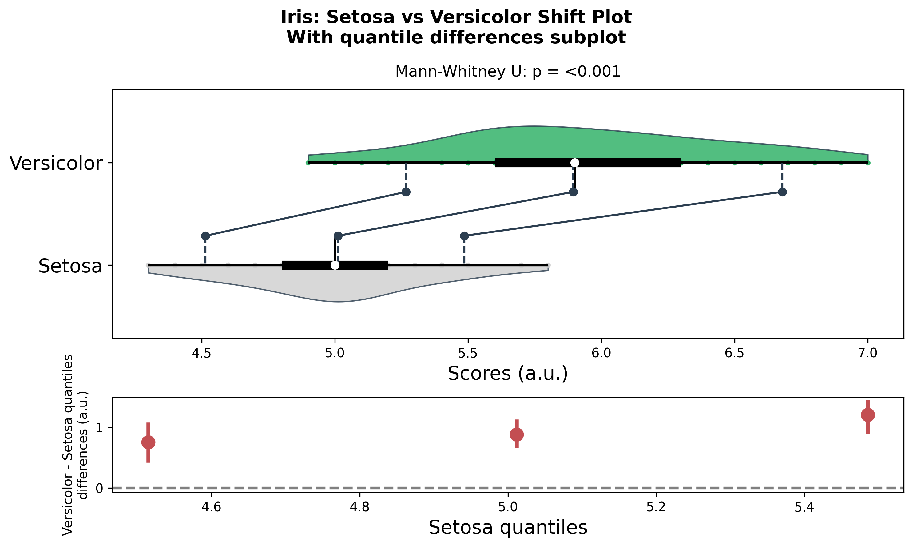
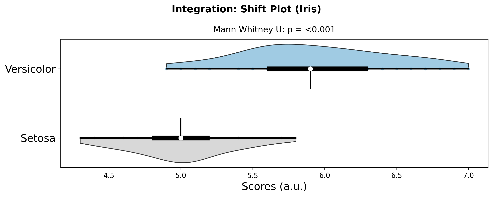
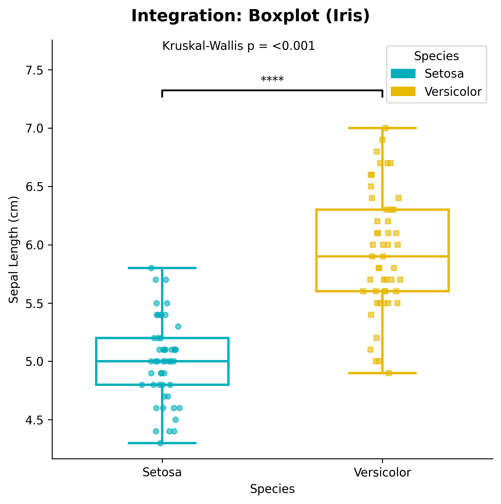

# Shift Plot

Shift plots (also known as difference plots or before-after plots) are used to visualize the differences between two related measurements. They are particularly useful for paired data analysis, before-after comparisons, and treatment effect visualization.

Note: The figures on this page are generated by running `examples/shiftplot_examples.py` and `examples/shiftplot_extra_examples.py` using identical parameters.

## Features

- **Paired data visualization**: Shows relationships between two related measurements
- **Difference highlighting**: Clearly displays the magnitude and direction of changes
- **Statistical annotations**: Optional statistical tests for paired comparisons
- **Custom styling**: Flexible color and marker options
- **Publication-ready**: Clean, professional appearance

## Basic Usage

```python
from ggpubpy import plot_shift, load_iris
import matplotlib.pyplot as plt

# Use Iris data: Setosa vs Versicolor sepal length (basic)
iris = load_iris()
x = iris[iris["species"] == "setosa"]["sepal_length"].values
y = iris[iris["species"] == "versicolor"]["sepal_length"].values

fig = plot_shift(x, y)

plt.show()
```


## Function Parameters

### `plot_shift()`

**Parameters:**

- `x` (array-like): First measurement (e.g., before treatment)
- `y` (array-like): Second measurement (e.g., after treatment)
- `x_label` (str, optional): Label for x-axis
- `y_label` (str, optional): Label for y-axis
- `title` (str, optional): Plot title
- `figsize` (tuple): Figure size (default: (8, 6))
- `alpha` (float): Transparency for points (default: 0.7)
- `color` (str): Color for points and lines (default: '#2E86AB')
- `line_color` (str): Color for connecting lines (default: '#A23B72')
  

**Returns:**
- `Figure`: matplotlib figure. Access axes via `fig.axes[0]`.

## Examples

<!-- Basic Shift Plot section removed in favor of Iris-based examples -->

### Shift Plot with Quantile Connectors (Main only)

```python
from ggpubpy import plot_shift, load_iris
import matplotlib.pyplot as plt
import numpy as np

# Use Iris data: Setosa vs Versicolor sepal length
iris = load_iris()
x = iris[iris["species"] == "setosa"]["sepal_length"].values
y = iris[iris["species"] == "versicolor"]["sepal_length"].values

# Main plot with quantile connectors (no bottom subplot)
fig = plot_shift(
    x,
    y,
    paired=False,
    n_boot=1000,
    percentiles=[10, 50, 90],
    confidence=0.95,
    violin=True,
    show_quantiles=True,
    show_quantile_diff=False,
    x_label="Setosa",
    y_label="Versicolor",
    title="Iris: Setosa vs Versicolor Shift Plot",
    subtitle="Main plot with quantile connectors",
    color="#27AE60",
    line_color="#2C3E50",
    alpha=0.8,
)

plt.show()
```




### Shift Plot with Quantile Differences Subplot

```python
from ggpubpy import plot_shift, load_iris
import matplotlib.pyplot as plt
import numpy as np

# Iris data: Setosa vs Versicolor
iris = load_iris()
x = iris[iris["species"] == "setosa"]["sepal_length"].values
y = iris[iris["species"] == "versicolor"]["sepal_length"].values

# Main plot + quantile differences subplot
fig = plot_shift(
    x,
    y,
    paired=False,
    n_boot=1000,
    percentiles=[10, 50, 90],
    confidence=0.95,
    violin=True,
    show_quantiles=True,
    show_quantile_diff=True,
    x_label="Setosa",
    y_label="Versicolor",
    title="Iris: Setosa vs Versicolor Shift Plot",
    subtitle="With quantile differences subplot",
    color="#27AE60",
    line_color="#2C3E50",
    alpha=0.8,
)

plt.show()
```

## When to Use Shift Plots

Shift plots are particularly useful for:

1. **Before-after studies**: Compare measurements before and after an intervention
2. **Paired data analysis**: Visualize relationships between related measurements
3. **Treatment effects**: Show individual responses to treatments
4. **Quality control**: Monitor changes in processes or products
5. **Longitudinal studies**: Track changes over time in the same subjects

## Interpretation

### Key Elements

1. **Points**: Each point represents a pair of measurements
2. **Lines**: Connect each pair, showing the direction and magnitude of change
3. **Diagonal line**: Reference line where x = y (no change)
4. **Position relative to diagonal**:
   - Above diagonal: y > x (increase/improvement)
   - Below diagonal: y < x (decrease/decline)
   - On diagonal: y = x (no change)

### Statistical Information

The plot includes:
- **Paired t-test**: Tests if the mean difference is significantly different from zero
- **Effect size**: Cohen's d for the paired difference
- **Confidence interval**: 95% CI for the mean difference

## Tips

1. **Sample size**: Works best with moderate to large sample sizes (n > 20)
2. **Outliers**: Be aware of extreme values that might skew the interpretation
3. **Color choices**: Use contrasting colors for points and lines for better visibility
4. **Transparency**: Adjust alpha to handle overlapping points
5. **Reference line**: The diagonal line helps interpret the direction of changes
6. **Statistical tests**: Use the built-in statistical annotations to quantify effects

## Integration

```python
from ggpubpy import plot_shift, plot_boxplot_with_stats, load_iris
import matplotlib.pyplot as plt
import numpy as np
import pandas as pd

# Iris dataset: Setosa vs Versicolor
iris = load_iris()
x = iris[iris["species"] == "setosa"]["sepal_length"].values
y = iris[iris["species"] == "versicolor"]["sepal_length"].values

# Shift plot for group comparison
fig_shift = plot_shift(x, y, x_label="Setosa", y_label="Versicolor", title="Integration: Shift Plot (Iris)")

# Box plot for distribution comparison
df = pd.DataFrame({
    'Group': ['Setosa'] * len(x) + ['Versicolor'] * len(y),
    'Value': np.concatenate([x, y])
})
fig_box, ax_box = plot_boxplot_with_stats(df, x="Group", y="Value", x_label="Species", y_label="Sepal Length (cm)")

plt.show()
```




## Advanced Usage

```python
from ggpubpy import plot_shift
from scipy import stats
import matplotlib.pyplot as plt
import numpy as np

# Create paired data
np.random.seed(42)
n = 30
before = np.random.normal(10, 2, n)
after = before + np.random.normal(1, 1.5, n)

# Create plot
fig = plot_shift(before, after, x_label="Before", y_label="After", title="Advanced: Shift with custom stat", subtitle="Wilcoxon signed-rank")

# Add custom statistical information
ax = fig.axes[0]
wilcoxon_stat, wilcoxon_p = stats.wilcoxon(before, after)
ax.text(0.02, 0.98, f'Wilcoxon signed-rank test:\np = {wilcoxon_p:.3f}', 
        transform=ax.transAxes, fontsize=10, verticalalignment='top',
        bbox=dict(boxstyle="round,pad=0.3", facecolor="lightgreen", alpha=0.7))

plt.show()
```


